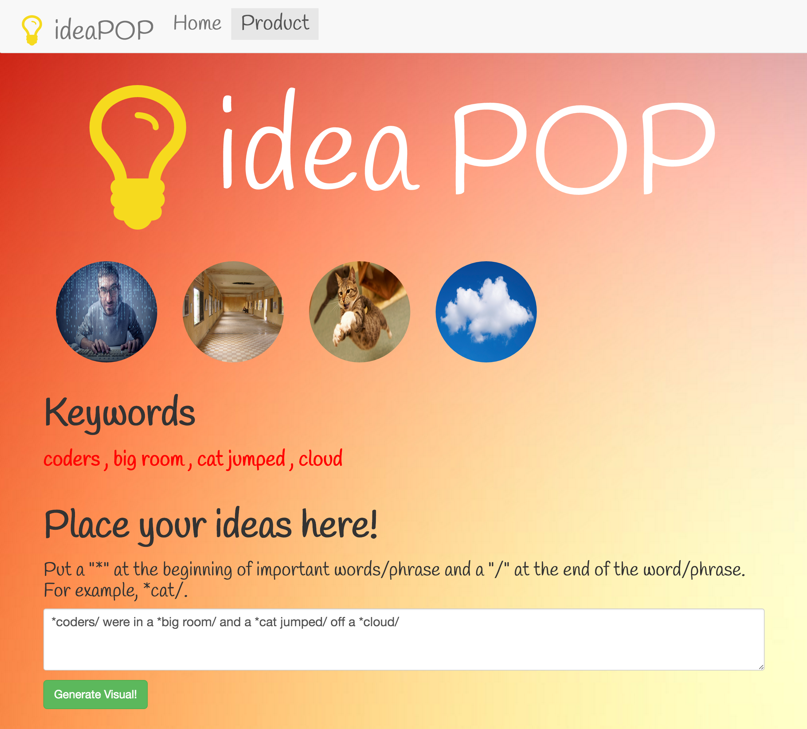

# :bulb: ideaPOP :boom:
Concept: A program that allows you to visualize your ideas. 

* Uses Google API and Flask

* Note: MAKE SURE TO RUN THIS WITH PYTHON  3.4 or it will not work!

Here is an example of what this program can do!

