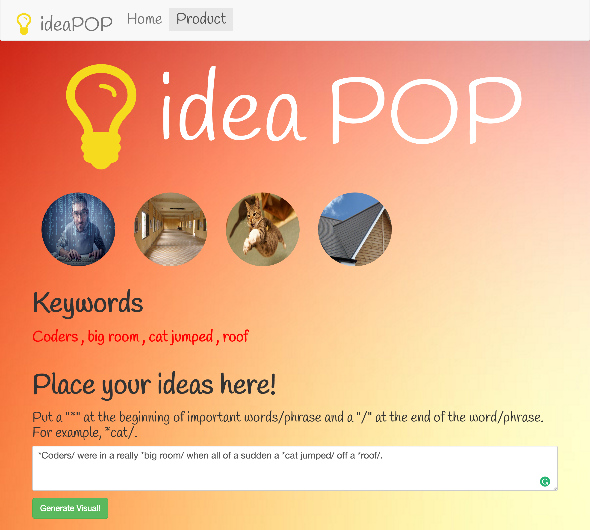

# :bulb: ideaPOP :boom:
Concept: A website that makes your ideas come to life.

Uses Google API and Flask

MAKE SURE TO RUN THIS WITH PYTHON  3.4 or it will not work!

This website is currently using Bootstrap and fontAwesome.

Here is an example of what this program can do!

